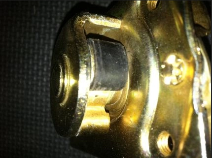
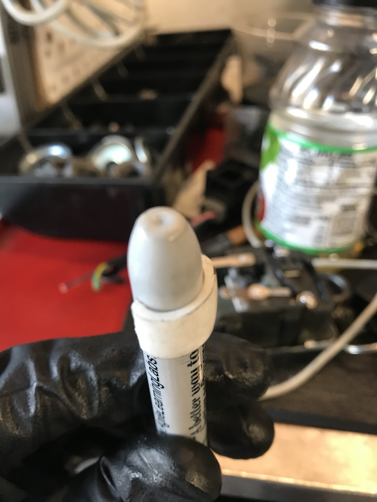
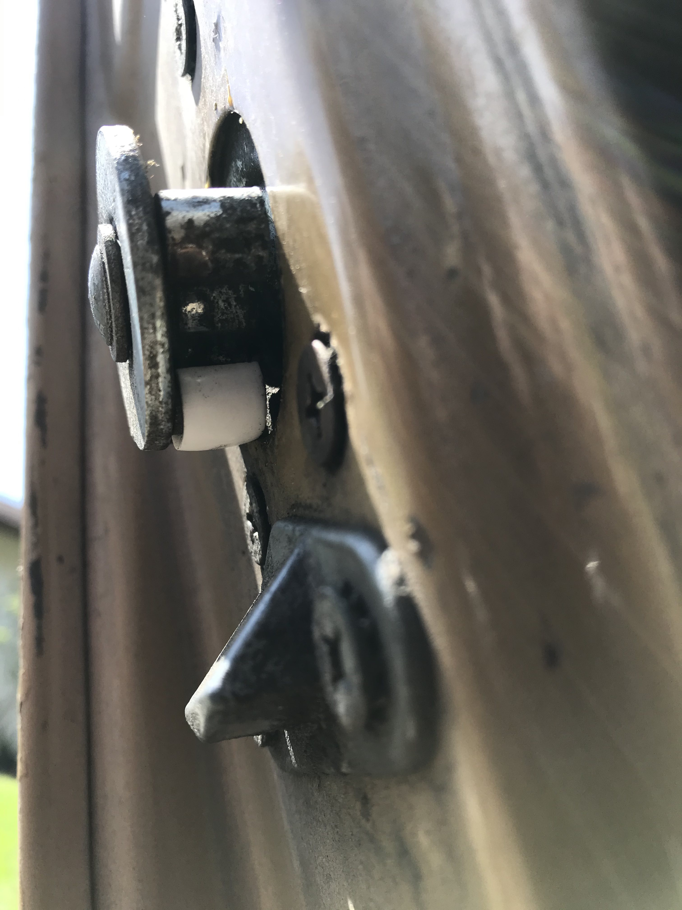

# Doors

## Door Slam

Old joints wear out, but the doors on the s30 can be repaired in several ways.

    1. Adjust the door stiker
    2. Replace the bushing on the doors rotating cam.
    3. Get a bigger pull tab so you can pull harder

Honestly try #2 before attempting to cut the striker plate, I found that I did 
not have to adjust anything once I installed the bushing. After 40 years that 
rubber bushing is long gone, mine was not even there, on either of my cars.

Here is a nice set you can order from 
[240zrubberparts.com](https://www.240zrubberparts.com/apps/webstore/products/show/4423585).
It's $40 for all of them. I'm a little cheap so I use this $2 tube:
[Home Depot Pex Tube 1/4" ID 3/8" OD](https://www.homedepot.com/p/SharkBite-1-4-in-3-8-in-O-D-x-5-ft-Straight-White-PEX-Pipe-U850W5/205586762). 
This tube is 5' long, so you can make a couple and stash them in your car to 
hand out to other s30 owners when you run into them.

This is where the bushing goes when you open the door, this lob on the bottom
side is the first one that contacts the striker plate on the inside of the door.

## Instructions
_______________

Once you have the tube you need to:

  1. Go boil a cup of water
  2. Cut 3/8 of length off the tube
  3. Slice the tube down one side
  4. Soak the cut tube in the cup of hot water to make it malleable
  5. (optional) push the hot pex cutting over the back end of a sharpie marker
   to expand it to 1/2", it makes it easier to form it over the lobe.
    
  
  
  6. Wrap one end of the warm pex tube over the lobe and compress it to the
   other side of the lobe, when it cools down (within a min) it will be held
   together by the tube wanting to form back to the cylinder.

Once this is complete you should be able to close the door with ease.

