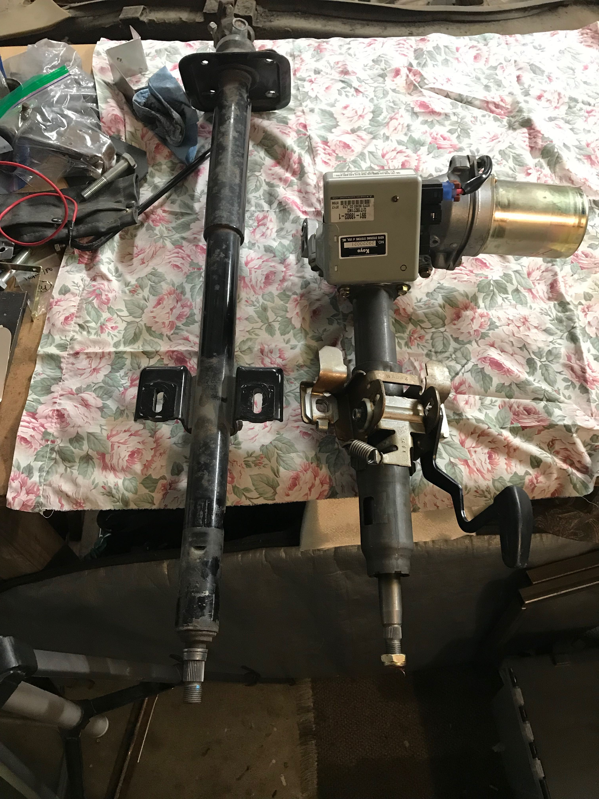
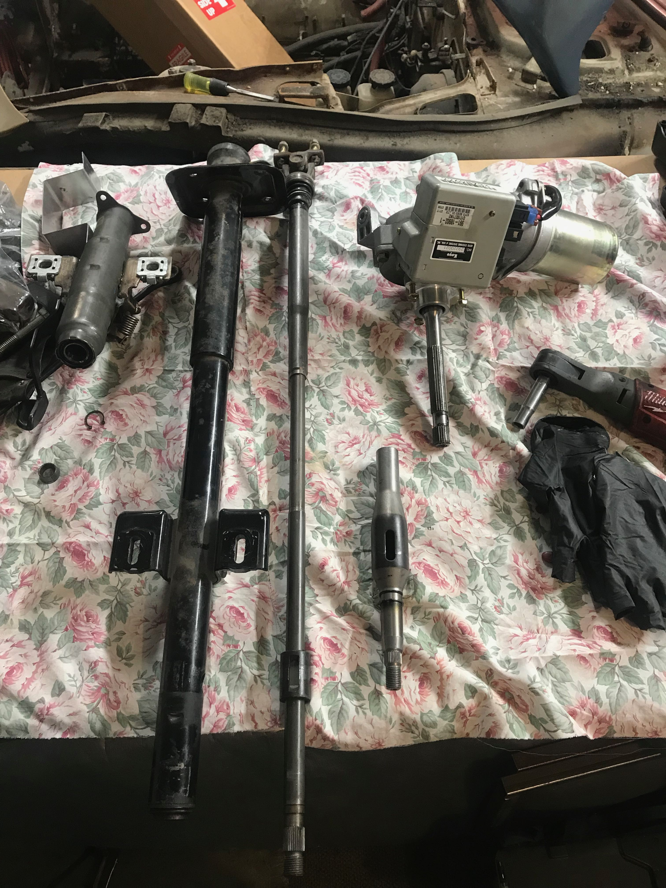

## EPAS Modification

Electronic Power Steering is a great way to no hate the car for daily use.
You can buy some ready to install packages for $800-$1400 USD, or if yourself
you can DIY the whole thing.

### References

Look at what these people are doing:

http://www.crankshaftcoalition.com/wiki/Steering_shaft_assemblies_from_junkyard_parts
https://forums.hybridz.org/topic/127807-saturn-electric-power-steering-in-a-datsun-280z
### Parts

- 2003-2008 Saturn Vue EPAS Steering Column + Steering Coupler

- Spare Steering Column to modify (not needed if you just pull the old one)

- Welder 

#### Safety

This car is a tin can, imagine yourself as the jellybean that's along for
the ride. Some people want to minimize risk in the design, the OEM ones have 
collapsible steering racks to prevent someone from getting impaled.

It appears that the 74+ cars get a updated steering column (this is probably due
to the change in the dashboard design). The part of the steering column near the
firewall can travel upward into the steering column to "collapse". The inner 
shaft that actually does all the work also appears that it will collapse into 
itself.

The Vue rack has an upper sleave that travels along the input spline on the 
motor, this leaves some space for it to compress, it also may assist with
the adjustment of the steering wheel. The steering coupler that connects the 
rack to the column also has a collapsible setup, which can also allow for 
additional safety.

#### Plans
 
Get a general idea of what everything looks like together.

Then take it apart and see how things are going to be grafted together.

In this image you can see the upper shaft that connects to the input spline on
the EPAS. This shaft seems like it can be grafted to the original shaft to 
allow for the assembly to be serviced in the future.

The OEM Saturn steering coupler will be placed inside a shaft that mounts to the
firewall. This will allow the coupler to be supported.

At the steering rack you can either modify and OEM spline connector or you can 
buy a Woodward UA113109 coupler that will actercept a 3/4" Double D shaft that the
Saturn coupler will use. 
